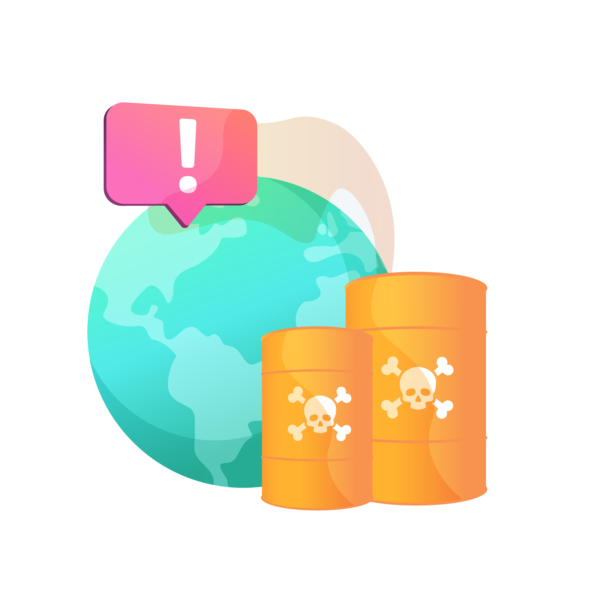
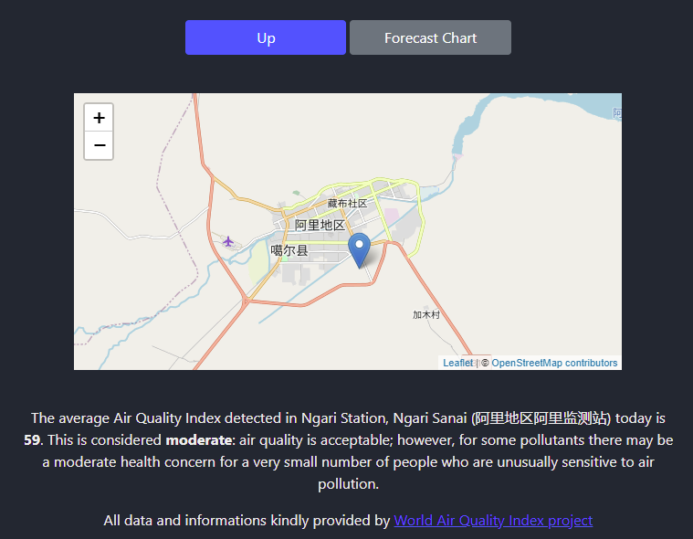

[![Contributors][contributors-shield]][contributors-url]
[![Issues][issues-shield]][issues-url]
[![Forks][forks-shield]][forks-url]
[![Stargazers][stars-shield]][stars-url]
[![MIT License][license-shield]][license-url]
[![LinkedIn][linkedin-shield]][linkedin-url]

<br />
<p align="center">
  <a href="https://github.com/fabio-mancin/city-pollution">
    
  </a>

  <h3 align="center">City Pollution</h3>

  <p align="center">
    Get AQI data for a location.
  </p>
</p>

<details open="open">
  <summary><h2 style="display: inline-block">Table of Contents</h2></summary>
  <ol>
    <li>
      <a href="#about-the-project">About The Project</a>
      <ul>
        <li><a href="#built-with">Built With</a></li>
      </ul>
    </li>
    <li>
      <a href="#getting-started">Getting Started</a>
      <ul>
        <li><a href="#prerequisites">Prerequisites</a></li>
        <li><a href="#installation">Installation</a></li>
      </ul>
    </li>
    <li><a href="#usage">Usage</a></li>
    <li><a href="#license">License</a></li>
    <li><a href="#contact">Contact</a></li>
    <li><a href="#acknowledgements">Acknowledgements</a></li>
  </ol>
</details>

## About The Project



This is a a simple web app that fetches Air Quality Index data from [AQICN](aqicn.org) via their free [API](https://aqicn.org/api/) and displays it.

The user can use the current geolocalized position, get a random one or manually insert coordinates.

The API fetches data from the station that is nearest to the selected coordinates and shows a local map (screenshot above) and a forecast chart.

### Built With

* [jQuery](https://jquery.com/)
* [Bootstrap](https://getbootstrap.com/)
* [Popper](https://popper.js.org/)
* [Lodash](https://lodash.com/)
* [Chart JS](https://www.chartjs.org/)
* [Leaflet](https://leafletjs.com/)
* [Tippy.js](https://atomiks.github.io/tippyjs/)
* [Axios](https://github.com/axios/axios)
* [Dotenv](https://github.com/motdotla/dotenv)

## Getting Started

To get a local copy up and running follow these simple steps.

### Prerequisites

* npm

  ```sh
  npm install npm@latest -g
  ```

### Installation

1. Clone the repository

   ```sh
   git clone https://github.com/fabio-mancin/city-pollution.git
   ```

2. Install NPM packages

   ```sh
   npm install
   ```

3. Build from source

   ```sh
   npm run build
   ```

4. Get a free API key at [Air Quality Open Data Platform](https://aqicn.org/data-platform/token/#/)

5. Create a .env file in the root folder with just one line:

   ```sh
   API_KEY = 'ENTER YOUR API'
   ```

6. Open dist/index.html

## Usage

The here button geolocalizes the current position and puts the relative coordinates in their fields.

Random chooses a random location on earth.

Custom lets the user insert his own custom coordinates.

The API finds the station that is closest to the chosen coordinates and returns some data.

The GO button shows where the station is on a map, an Air Quality forecast chart and a quick comment about the current Air Quality level.

## License

Distributed under the MIT License. See `LICENSE` for more information.

## Contact

Fabio Mancin - [@Fabio__Mancio](https://twitter.com/Fabio__Mancio) - fabio.mancin90 at gmail dot com

Project Link: [City Pollution](https://github.com/fabio-mancin/city-pollution)

Portfolio: [fabiomancin.org](https://fabiomancin.org)

## Acknowledgements

* [Best-README-Template](https://github.com/othneildrew/Best-README-Template)
* [Abstract vector created by vectorjuice - www.freepik.com](https://www.freepik.com/vectors/abstract)
* [Air Pollution: Real-time Air Quality Index (AQI)](https://aqicn.org/)

[contributors-shield]: https://img.shields.io/github/contributors/fabio-mancin/city-pollution?style=for-the-badge
[contributors-url]: https://github.com/fabio-mancin/city-pollution/graphs/contributors
[forks-shield]: https://img.shields.io/github/forks/fabio-mancin/city-pollution?style=for-the-badge
[forks-url]: https://github.com/fabio-mancin/city-pollution/network/members
[stars-shield]: https://img.shields.io/github/stars/fabio-mancin/city-pollution?style=for-the-badge
[stars-url]: https://github.com/fabio-mancin/city-pollution/stargazers
[issues-shield]: https://img.shields.io/github/issues/fabio-mancin/city-pollution?style=for-the-badge
[issues-url]: https://github.com/fabio-mancin/city-pollution/issues
[license-shield]: https://img.shields.io/github/license/fabio-mancin/city-pollution?style=for-the-badge
[license-url]: https://github.com/fabio-mancin/repo/blob/master/LICENSE.txt
[linkedin-shield]: https://img.shields.io/badge/-LinkedIn-black.svg?style=for-the-badge&logo=linkedin&colorB=555
[linkedin-url]: https://linkedin.com/in/fabio-mancin